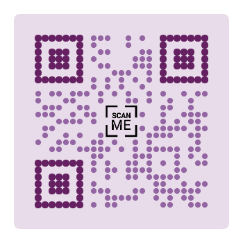

# react-qrcode-pretty

[](https://guilhermeasn.github.io/react-qrcode-pretty/)
[](https://www.npmjs.com/package/react-qrcode-pretty/)
[](https://www.npmjs.com/package/react-qrcode-pretty/v/latest)

[Qrcode generator website](https://guilhermeasn.github.io/react-qrcode-pretty/)

Qrcode generator for react apps with many customization options.

## Installation

Run the command below in the terminal to install **react-qrcode-pretty** in your project

```
npm i react-qrcode-pretty
```

Or with Yarn

```
yarn add react-qrcode-pretty
```

## QrCode Props

|Prop|Type|Default|Details|
|---|---|---|---|
| value | `string` | | Qrcode payload (required) |
| size | `number` | auto | Size of the qrcode without margin and padding |
| resize | `number` | undefined | Resize ready qrcode with CSS |
| color | `string` <br /> `{ 'eyes': string, 'body': string }` | '#000000' | Foreground color for the entire qrcode or for each part (eyes and body) of the qrcode |
| mode | `Numeric` <br /> `Alphanumeric` <br /> `Byte` <br /> `Kanji` | 'Byte' | Mode that payload (value) will be logged |
| level | `L` <br /> `M` <br /> `Q` <br /> `H` | 'M' | Error correction level |
| modules | `[0-40]` | 0 | Number of qrcode modules. 0 is auto |
| image | `string` | undefined | Location (src) of an image to be inserted into the center of the qrcode |
| imageBig | `boolean` | false | Image to be displayed in full size |
| overlap | `boolean` | false | For the image to overlay the qrcode without cropping it |
| margin | `number` | 0 | Margin size. Area without background color |
| padding | `number` | 0 | Padding size. Area with background color |
| variant | `standard` <br /> `rounded`  <br /> `dots` <br /> `fluid` <br /> `reverse` <br /> `shower` <br /> `gravity`  <br /> `morse` <br /> `{ 'eyes': variant, 'body': variant }` | 'standard' | Style applied to the entire qrcode or each part (eyes and body) of it |
| divider | `boolean` | false | Active a small separation between the qrcode body points |
| bgColor | `string` | '#FFFFFF' | Background color |
| bgRounded | `boolean` | false | Background color rounded |
| children | `React.ReactNode` | undefined | The canvas tag children |
| canvasProps | `React.HTMLAttributes<HTMLCanvasElement>` | {} | The canvas attributes |
| onReady | `(canvas : HTMLCanvasElement) => void` | undefined | Provides canvas properties and methods when available. |

## Code Example

```js
import { QrCode } from "react-qrcode-pretty";

export default function QrCodeCustom({ value = 'react-qrcode-pretty' }) {

    return (

        <QrCode
            value={ value }
            variant={{
                eyes: 'gravity',
                body: 'fluid'
            }}
            color={{
                eyes: '#223344',
                body: '#335577'
            }}
            padding={ 20 }
            margin={ 20 }
            bgColor='#ddeeff'
            bgRounded
            divider
        />

    );

}
```

## Qrcode Examples





## Author

* **Guilherme Neves** - [github](https://github.com/guilhermeasn/) - [website](https://gn.dev.br/)

## License

This project is under the MIT license - see file [LICENSE](https://github.com/guilhermeasn/react-qrcode-pretty/blob/master/LICENSE) for details.
